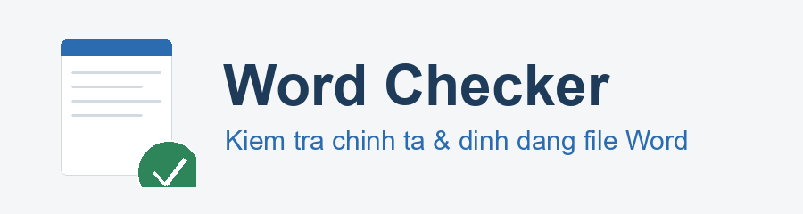

# Word Checker — Kiểm tra chính tả & định dạng file Word trước khi nộp

<p align="center">
  
</p>

[](https://github.com/tridpt/word-checker/actions/workflows/tests.yml)
[](LICENSE)

Tool dòng lệnh (chạy offline) giúp rà soát file `.docx` trước khi nộp: kiểm tra
định dạng (font, cỡ chữ, giãn dòng, canh lề, lề trang), lỗi cơ học văn bản (cách
đôi, dấu cách thừa/thiếu...) và lỗi chính tả tiếng Việt thường gặp. Cũng nhận file
`.doc` cũ (tự chuyển sang `.docx` nếu máy có cài Microsoft Word hoặc LibreOffice).
Ngoài ra còn
hiện thống kê nhanh (số từ, số đoạn, số trang ước tính, thời gian đọc).

## Cài đặt

Cần Python 3.10+ (đã test trên 3.13).

```bash
pip install -r requirements.txt
```

## Cách dùng

```bash
# Kiểm tra cơ bản, in kết quả ra màn hình
python cli.py bai_tap.docx

# Xuất thêm báo cáo HTML để xem cho dễ
python cli.py bai_tap.docx --html bao_cao.html

# Xuất báo cáo PDF (tiện gửi/nộp kèm)
python cli.py bai_tap.docx --pdf bao_cao.pdf

# Bỏ qua một loại kiểm tra nếu muốn
python cli.py bai_tap.docx --no-spelling
python cli.py bai_tap.docx --no-format
python cli.py bai_tap.docx --no-text

# Chọn profile quy chuẩn khác (hanh_chinh | luan_van | cong_ty)
python cli.py bai_tap.docx --profile luan_van

# Học quy chuẩn từ một file .docx mẫu rồi kiểm theo đúng mẫu đó
python cli.py bai_tap.docx --template mau_chuan.docx

# Tự động sửa lỗi cơ học + chính tả, lưu ra file mới (KHÔNG ghi đè file gốc)
python cli.py bai_tap.docx --fix
python cli.py bai_tap.docx --fix --out ban_sach.docx

# Sửa luôn cả định dạng (font, cỡ chữ, giãn dòng, canh lề, lề trang) theo profile
python cli.py bai_tap.docx --fix-format
python cli.py bai_tap.docx --fix-format --template mau_chuan.docx

# Kiểm tra giới hạn số từ / số trang (vd tiểu luận phải dưới 2000 từ)
python cli.py bai_tap.docx --max-words 2000 --min-words 500
python cli.py bai_tap.docx --max-pages 10

# Kiểm tra cả một thư mục chứa nhiều file .docx, gộp 1 báo cáo HTML
python cli.py thu_muc_bai_tap --html bao_cao_tong.html

# Xuất kết quả ra JSON (để tích hợp/tự động hóa)
python cli.py bai_tap.docx --json ket_qua.json

# Xuất bản sao .docx có chú thích (comment) ngay tại chỗ lỗi -> *_commented.docx
python cli.py bai_tap.docx --annotate

# Bật kiểm tra chính tả bằng AI/LLM (cần cấu hình LLM_API_KEY trong .env)
python cli.py bai_tap.docx --llm-spelling
```

Tool thoát với mã `1` nếu phát hiện lỗi nghiêm trọng (tiện cho việc tự động hóa),
`0` nếu file sạch.

## Thử nhanh với file mẫu

```bash
python make_sample.py            # tạo sample.docx có sẵn lỗi
python cli.py sample.docx --html bao_cao.html
```

## Kiểm tra những gì?

**Định dạng** (`checker/formatting.py`)
- Font chữ trong thân bài có đúng quy chuẩn không
- Cỡ chữ có nằm trong danh sách cho phép không
- Canh lề (canh đều / trái / giữa / phải)
- Giãn dòng
- Lề trang (trên/dưới/trái/phải)
- Thụt lề dòng đầu, khoảng cách trước/sau đoạn (khi bật trong profile)
- Cảnh báo khi thân bài dùng nhiều font/cỡ chữ khác nhau (không đồng nhất)

**Lỗi cơ học văn bản** (`checker/textcheck.py`)
- Dấu cách đôi (nhiều dấu cách liên tiếp)
- Dấu cách thừa trước dấu câu (`,` `.` `;` `:` `!` `?` `)`)
- Thiếu dấu cách sau `,` `;` `:`
- Khoảng trắng thừa cuối đoạn
- Khoảng trắng thừa bên trong dấu ngoặc
- Nhiều đoạn trống liên tiếp
- Lặp từ liền nhau (chỉ với hư từ như "các các", "và và" — tránh báo nhầm từ láy)
- Thiếu viết hoa đầu câu (có chặn viết tắt và số thứ tự)
- Dùng hai gạch nối `--` thay vì gạch ngang `–`
- Lẫn lộn dấu nháy thẳng `"` và nháy cong `" "` trong tài liệu
- Chữ còn bỏ quên (Lorem ipsum, TODO, FIXME, `[...]`, chuỗi `xxxx`...)

**Giới hạn số từ / trang** (`checker/limits.py`, tùy chọn)
- Cảnh báo khi vượt/thiếu số từ hoặc vượt số trang ước tính
- Bật bằng `--max-words` / `--min-words` / `--max-pages` hoặc đặt trong `config.LIMITS`

**Tiêu đề mục & đánh số** (`checker/headings.py`)
- Nhảy cấp tiêu đề (ví dụ Heading 1 nhảy thẳng sang Heading 3)
- Đánh số đề mục không liên tục (ví dụ 1, 2, 4 — thiếu 3; hoặc 1.1, 1.3 — thiếu 1.2)

> **Giảm nhiễu công thức**: với tài liệu học thuật nhiều công thức toán, tool tự
> nhận diện và **bỏ qua các đoạn nhiều ký hiệu toán** khi kiểm tra font/cỡ chữ/dấu
> câu (tránh báo nhầm). Tắt bằng `--no-skip-math` hoặc đặt `SKIP_MATH=False` trong
> `config.py`. Báo cáo cũng **gộp các lỗi định dạng lặp lại** thành một dòng tổng
> hợp để dễ đọc.

> **Soát cả ngoài thân bài**: ngoài các đoạn văn thường, tool còn dò lỗi cơ học
> và chính tả trong **bảng biểu, đầu/chân trang (header/footer) và text box** —
> những chỗ bài nộp thật hay có nội dung nhưng dễ bị bỏ sót. Các vùng này chỉ
> kiểm lỗi văn bản/chính tả, KHÔNG kiểm định dạng (font/cỡ chữ) vì bảng và
> đầu/chân trang thường dùng định dạng riêng một cách hợp lệ. Thống kê số từ vẫn
> chỉ tính thân bài để không bị lệch.

**Chính tả** (`checker/spelling.py`)
- Dò theo từ điển lỗi thường gặp `dictionaries/common_typos.txt`
- An toàn, ít báo nhầm vì chỉ báo các cặp lỗi đã biết chắc

**Chính tả bằng AI/LLM** (`checker/llm_spelling.py`, tùy chọn)
- Dùng mô hình ngôn ngữ để bắt lỗi rộng hơn từ điển
- TẮT mặc định, chỉ bật khi đã cấu hình `LLM_API_KEY` (xem `.env.example`)
- Kết quả mang tính gợi ý nên xếp mức "cảnh báo"; có lọc bỏ trường hợp AI "bịa"
  (chỉ nhận lỗi khi cụm từ thật sự xuất hiện trong đoạn)

## Giao diện kéo-thả (web app)

Thích bấm chuột hơn gõ lệnh thì chạy web app:

```bash
pip install -r requirements.txt
python webapp.py
```

Mở trình duyệt tại http://127.0.0.1:5000, kéo **một hoặc nhiều** file `.docx` (hoặc `.doc`) vào,
chọn quy chuẩn rồi bấm **Kiểm tra** để xem báo cáo ngay trên trang, **Tự động sửa
& tải về** để nhận file đã sửa, **Tải file có chú thích lỗi** để nhận bản `.docx`
có comment, hoặc **Tải báo cáo PDF**. Có nút đổi **giao diện sáng/tối** ở góc trên.

Web app chạy cục bộ (localhost), file upload chỉ được xử lý tạm rồi xóa, không
gửi đi đâu và không lưu lại. Lưu ý: không có lớp xác thực, nên đừng mở cổng này
ra internet công cộng — chỉ dùng trên máy của bạn.

## Tùy chỉnh quy chuẩn

Mở `config.py` và sửa `FORMAT_PROFILE` cho khớp yêu cầu của trường/công ty bạn
(font, cỡ chữ, giãn dòng, canh lề, lề trang). Mặc định theo chuẩn văn bản phổ
biến ở Việt Nam: Times New Roman, cỡ 13–14, giãn dòng 1.5, canh đều.

Có sẵn nhiều profile trong `config.PROFILES`, chọn bằng `--profile`:
- `hanh_chinh` (mặc định): Times New Roman 13–14, giãn 1.5, canh đều.
- `luan_van`: Times New Roman 13, lề trái rộng 3.5cm để đóng quyển.
- `cong_ty`: cho phép Arial/Calibri 11–12, giãn 1.15.

## Học quy chuẩn từ file mẫu (--template)

Không muốn chỉnh `config.py` bằng tay? Đưa cho tool một file `.docx` đã đúng
chuẩn (ví dụ file mẫu của trường/công ty), nó tự rút ra quy chuẩn (font, cỡ chữ,
giãn dòng, canh lề, lề trang, thụt lề dòng đầu) rồi kiểm các file khác theo đúng
mẫu đó:

```bash
python cli.py bai_nop.docx --template mau_chuan.docx
```

Trên web app cũng có ô "hoặc file mẫu" — chọn file mẫu là tool kiểm theo mẫu đó
(ưu tiên hơn lựa chọn quy chuẩn).

Để bổ sung lỗi chính tả, thêm dòng vào `dictionaries/common_typos.txt` theo
định dạng `từ_sai = từ_đúng`.

## Chính tả bằng AI/LLM (tùy chọn)

Muốn bắt lỗi rộng hơn từ điển, bật kiểm tra bằng mô hình ngôn ngữ:

1. Copy `.env.example` thành `.env`, điền `LLM_API_KEY` (hỗ trợ OpenAI-compatible:
   Groq, Gemini, OpenAI...).
2. CLI: thêm cờ `--llm-spelling`. Web app: hiện thêm ô "Chính tả AI" khi đã cấu hình.

Tính năng này gửi nội dung văn bản tới dịch vụ LLM bạn cấu hình, nên chỉ dùng khi
chấp nhận điều đó. Nếu không cấu hình key thì tính năng tắt hoàn toàn, phần còn
lại của tool vẫn chạy offline bình thường.

## Tự động sửa (--fix)

`python cli.py bai_tap.docx --fix` sẽ tạo file mới `bai_tap_fixed.docx` (không
đụng file gốc) với các lỗi đã được sửa tự động:
- Gộp dấu cách đôi thành một
- Bỏ dấu cách thừa trước dấu câu, thêm dấu cách thiếu sau `,` `;` `:`
- Cắt khoảng trắng cuối đoạn
- Xóa các đoạn trống thừa
- Sửa lỗi chính tả nằm trong từ điển (giữ nguyên kiểu viết hoa)

Thêm `--fix-format` sẽ sửa luôn cả **định dạng** theo profile: đổi font/cỡ chữ về
giá trị chuẩn (chọn giá trị đang dùng phổ biến nhất để không gây lệch), đặt lại
giãn dòng, canh lề, lề trang. Kết hợp với `--template` để sửa theo file mẫu.

## File Word có chú thích (--annotate)

`python cli.py bai_tap.docx --annotate` tạo bản `bai_tap_commented.docx`: mỗi
đoạn có lỗi được gắn một comment (mở bằng Microsoft Word sẽ thấy ở lề phải, liệt
kê đủ lỗi của đoạn đó). Lỗi cấp tài liệu (lề trang, font không đồng nhất...) được
gom vào một comment ở đầu tài liệu. File gốc không bị thay đổi.

## Xuất JSON (--json)

`python cli.py bai_tap.docx --json ket_qua.json` xuất toàn bộ kết quả dạng JSON
để cắm vào công cụ khác hoặc tự động hóa. Mỗi lỗi gồm: nhóm, mức độ, mô tả, vị
trí, trích đoạn, gợi ý sửa.

## Chạy test

```bash
pip install -r requirements-dev.txt
pytest
```

## Đóng gói thành .exe (chạy không cần Python)

Để người khác dùng mà không cần cài Python, đóng gói web app thành một file `.exe`:

```bash
pip install pyinstaller
build_exe.bat
```

Kết quả nằm ở `dist\WordChecker.exe`. Double-click để chạy: chương trình tự khởi
động server cục bộ và mở trình duyệt tới giao diện kéo-thả. Đóng cửa sổ console
là tắt. File này gói sẵn giao diện `web/` và từ điển `dictionaries/` nên chạy độc
lập, chỉ cần copy mỗi file `.exe` sang máy khác (Windows) là dùng được.

## Cấu trúc dự án

```
word-checker/
├─ cli.py                      # điểm vào dòng lệnh
├─ webapp.py                   # web app kéo-thả (Flask)
├─ launch.py                   # launcher cho bản .exe (tự mở trình duyệt)
├─ build_exe.bat               # script đóng gói thành .exe (kèm icon)
├─ gen_assets.py               # tạo icon + logo
├─ config.py                   # quy chuẩn định dạng (chỉnh ở đây)
├─ make_sample.py              # tạo file Word mẫu để thử
├─ LICENSE                     # giấy phép MIT
├─ requirements.txt
├─ requirements-dev.txt        # thêm pytest để chạy test
├─ pytest.ini
├─ assets/                     # icon.ico, icon.png, logo.png
├─ web/
│  └─ index.html               # giao diện kéo-thả
├─ dictionaries/
│  └─ common_typos.txt         # từ điển lỗi chính tả thường gặp
├─ tests/                      # bộ test pytest
└─ checker/
   ├─ document.py              # đọc .docx, phân giải font hiệu lực
   ├─ formatting.py            # kiểm tra định dạng
   ├─ textcheck.py             # kiểm tra lỗi cơ học văn bản
   ├─ headings.py              # kiểm tra tiêu đề mục & đánh số
   ├─ limits.py                # kiểm tra giới hạn số từ / trang
   ├─ mathdetect.py            # nhận diện đoạn công thức để giảm nhiễu
   ├─ stats.py                 # thống kê tài liệu (số từ, số trang, thời gian đọc)
   ├─ spelling.py              # kiểm tra chính tả (từ điển, offline)
   ├─ llm_spelling.py          # kiểm tra chính tả bằng AI/LLM (tùy chọn)
   ├─ autofix.py               # tự động sửa lỗi, lưu file mới
   ├─ annotate.py              # xuất .docx có comment tại chỗ lỗi
   ├─ runner.py                # gom logic chạy kiểm tra (dùng chung CLI + web)
   ├─ learn_profile.py         # học quy chuẩn định dạng từ file .docx mẫu
   ├─ resources.py             # phân giải đường dẫn tài nguyên (dev + .exe)
   ├─ convert.py               # chuyển .doc cũ sang .docx (Word/LibreOffice)
   ├─ issues.py                # cấu trúc một "lỗi"
   ├─ report.py                # in kết quả + xuất HTML
   └─ pdf_report.py            # xuất báo cáo PDF (font Unicode tiếng Việt)
```

## Hướng mở rộng

- Tạo GitHub Release đính kèm sẵn file `.exe` để tải về chạy ngay.
- Tiếp tục mở rộng từ điển chính tả `dictionaries/common_typos.txt`.

## Giấy phép

Phát hành theo giấy phép [MIT](LICENSE) — tự do dùng, sửa, chia sẻ.
